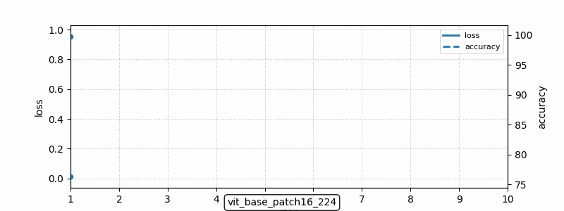
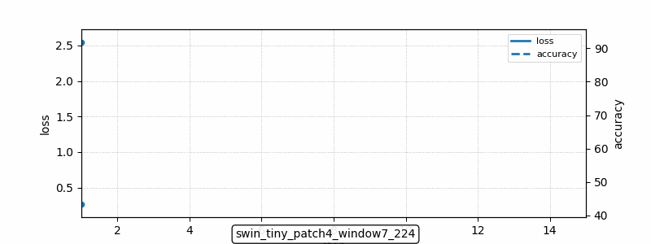
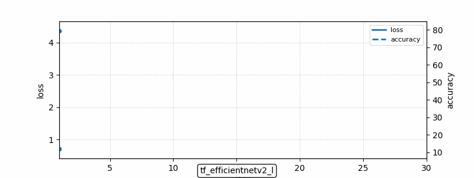
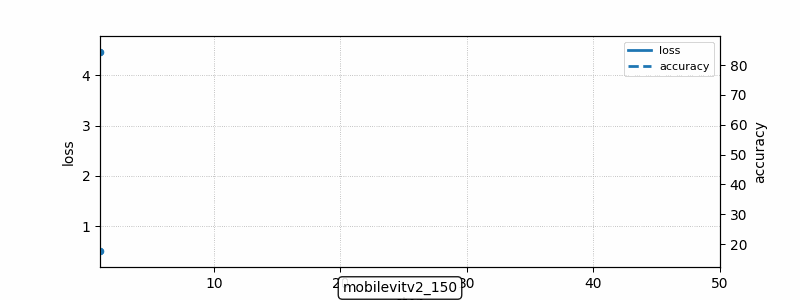

 
<p align="center">
  <h1>🧠 Fine-Tuning Vision Models on CIFAR-100</h1>
  <p>Modern transfer learning experiments with ViT, Swin, EfficientNet, ConvNeXt & more.</p>
</p>

<p align="center">
  
  
  
  
  
  
</p>

---

## 🚀 Overview

This repository provides clean, reproducible experiments for fine-tuning modern vision architectures on **CIFAR-100**.

✔ Transfer learning with pretrained weights  
✔ TensorBoard logging  
✔ Notebook-based experimentation  
✔ Modular project structure  
✔ Visual training results  

---

## ⚡ 30-Second Setup

```bash
# Install dependencies with uv
uv add torch torchvision timm tensorboard tqdm jupyter

# Launch notebook
jupyter notebook notebooks/finetuning_vit_cifar100.ipynb
````

---

## 📦 Installation (Using uv)

### 1️⃣ Install uv

```bash
curl -LsSf https://astral.sh/uv/install.sh | sh
```

### 2️⃣ Add dependencies

```bash
uv add torch torchvision timm tensorboard tqdm jupyter
uv sync
```

> For CUDA builds, install the appropriate PyTorch wheel via `uv pip install <wheel_url>`.

---

## 📓 Running Jupyter from CLI

```bash
# Start Notebook UI
jupyter notebook

# Start JupyterLab
jupyter lab

# Open specific notebook
jupyter notebook notebooks/finetuning_vit_cifar100.ipynb

# Remote / headless mode
jupyter notebook --no-browser --ip=0.0.0.0 --port=8888
```

Start TensorBoard:

```bash
tensorboard --logdir runs --port 6006
```

---

## 🧠 Supported Architectures

| Model                    | Library |
| ------------------------ | ------- |
| ViT (Vision Transformer) | timm    |
| Swin-T                   | timm    |
| EfficientNetV2-L         | timm    |
| ConvNeXt                 | timm    |
| MobileViT                | timm    |

All models are initialized with `pretrained=True` and adapted to 100 classes.

---

## 📊 Training Visualizations

<p align="center">
  
  
</p>

<p align="center">
  <b>ViT-B/16</b> &nbsp;&nbsp;&nbsp;&nbsp;&nbsp;&nbsp;&nbsp;&nbsp;
  <b>Swin-T</b>
</p>

<br/>

<p align="center">
  
  
</p>

<p align="center">
  <b>EfficientNetV2-L</b> &nbsp;&nbsp;&nbsp;&nbsp;
  <b>MobileViT</b>
</p>

---

## 🗂 Project Structure

```
data/        # CIFAR-100 dataset
gifs/        # Training animations
notebooks/   # Experiment notebooks
src/         # Training & model utilities
tests/       # Unit tests
Makefile
pyproject.toml
README.md
```

---

## 🔬 Training Pipeline


* Load CIFAR-100
* Apply augmentations
* Initialize pretrained model via `timm`
* Replace classification head
* Train + log metrics with TensorBoard

---

## 💡 Tips

* Resize CIFAR images when using 224×224 pretrained models.
* Freeze backbone layers for faster experimentation.
* Compare transformers vs CNNs under identical hyperparameters.

---

## 📄 License

MIT License — see `LICENSE`.

---

<p align="center">
  Built with PyTorch • timm • uv • CIFAR-100
</p>
```
